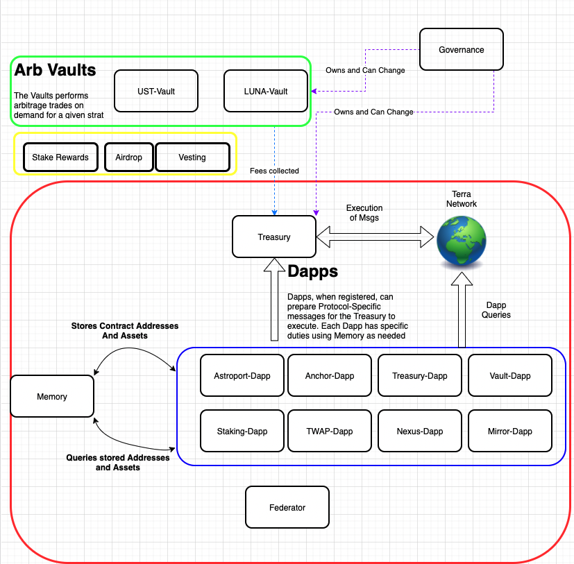

# White Whale Architecture 

The White Whale protocol is composed of a number of different services implemented as smart contracts. The following architectural diagram describes the groups of services and how they interact with one another.

