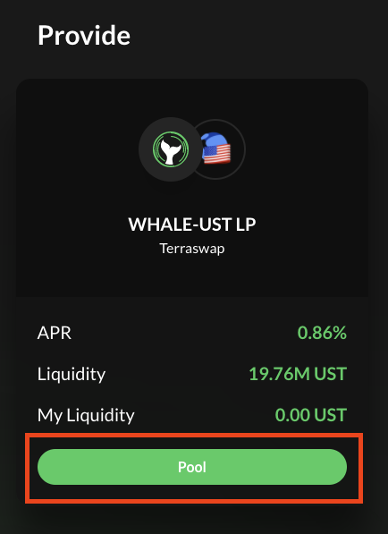
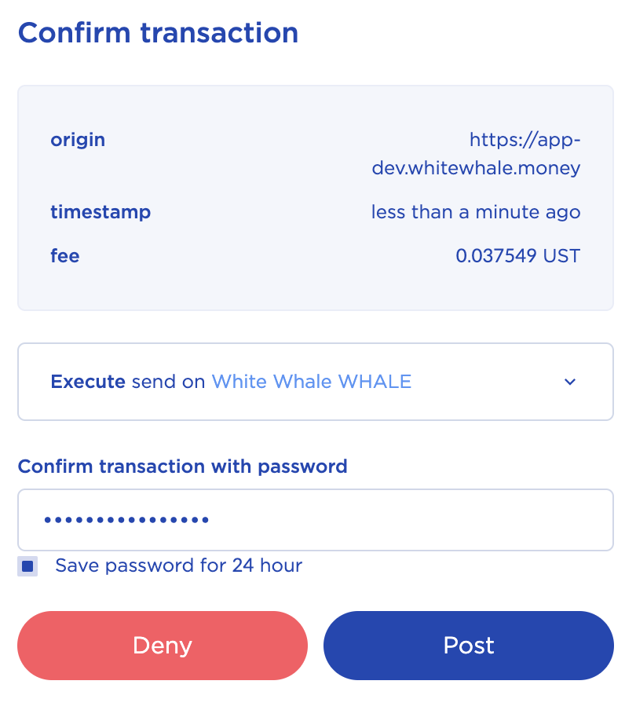
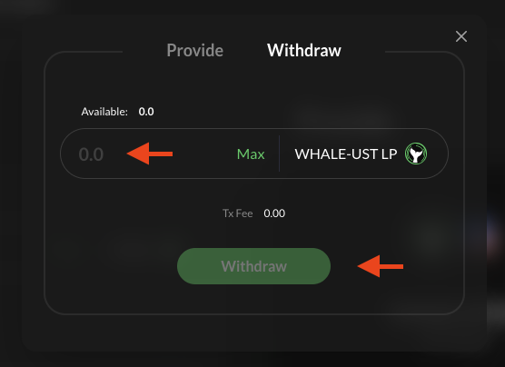

# Providing liquidity for WHALE Token

**Liquidity can be provided for WHALE Tokens** [**https://app.whitewhale.money/swap**](https://app.whitewhale.money/swap)**.**

The **WHALE** tokens can be used for governance staking and voting. See **STAKING** section for details. Note that the liquidity providing rewards are only from transaction fees. There are no token reward incentives for providing WHALE-UST liquidity. 

> Tutorial below assumes you have the a Terra Wallet with UST and WHALE token. If not, see the WebApp and Swap sections.

### Providing WHALE-UST Liquidity

1. Connect Wallet

2. Navigate to the **SWAP** page

3. Hit **POOL**

3. Confirm transaction in terra station by hitting post. 

4. Your WHALE tokens will show up in your wallet shortly!

### Withdrawing WHALE-UST Liquidity

1. Navigate to the **SWAP** page

2. Hit **POOL**

3. Hit Withdraw. Then enter the amount of WHALE-UST LP tokens you would like to withdraw and hit **Withdraw**

3. Confirm transaction in terra station by hitting post. 

4. Your WHALE and UST will show up in your wallet shortly!