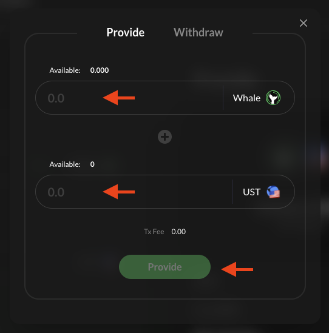
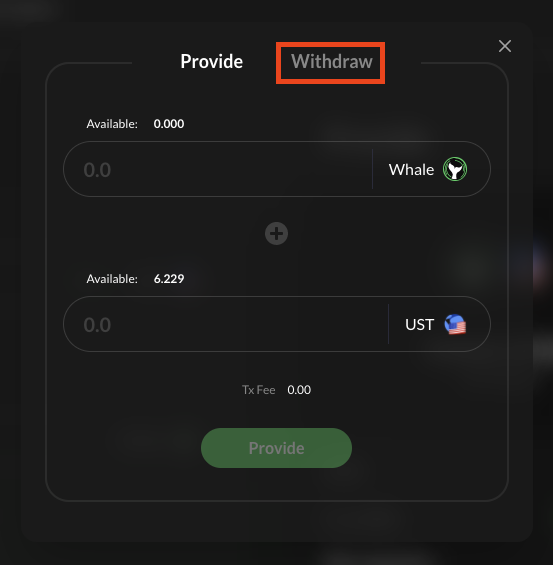

# Liquidity Providing

**Liquidity can be provided for WHALE Tokens** [**https://app.whitewhale.money/swap**](https://app.whitewhale.money/swap)**.**

The **WHALE** tokens can be used for governance staking and voting. See **STAKING** section for details. Note that the liquidity providing rewards are only from transaction fees. There are no token reward incentives for providing WHALE-UST liquidity. 

> Tutorial assumes you have:  
> A Terra Wallet. If not, see the WebApp section.  
> WHALE tokens. If not, see the Swap section. 

### Providing WHALE-UST Liquidity

**1.** Connect Wallet

**2.** Navigate to the **\[SWAP\]** page

  

**3.** Select **\[POOL\]**

**4.** Enter equal amounts of WHALE and UST that you would like to provide as liquidity. Then select **\[PROVIDE\]**

**5.** Select **\[POST\]** to confirm the transaction 

### Withdrawing WHALE-UST Liquidity

**1.** Navigate to the **\[SWAP\]** page

**2.** Select **\[POOL\]**

**3.** Select **\[Withdraw\]**
   

**4.**  Enter the amount of WHALE-UST LP tokens you would like to withdraw. Then select **\[Withdraw\]**

**5.** Select **\[POST\]** to confirm the transaction

**6.** Your WHALE and UST will show up in your wallet shortly!