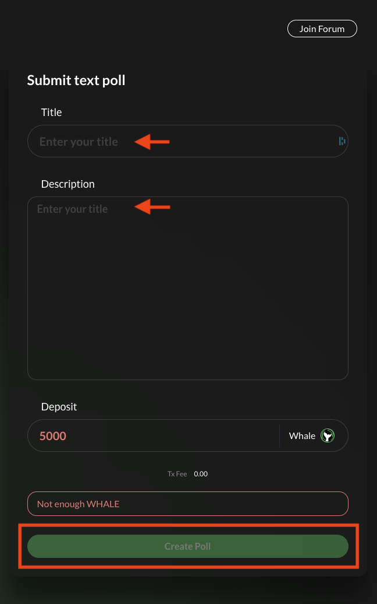

# Creating and voting on proposals

**Whale Tokens can be used for governance proposals and voting at** [**https://app.whitewhale.money/gov**](https://app.whitewhale.money/gov)**.**

The **White Whale Governance Staking V1** is a fork of Anchor Protocol's Governance Staking smart contracts. 5k WHALE is needed to create a proposal. If the proposal fails the WHALE tokens are forfeited. 

> Tutorial below assumes you have the a Terra Wallet. If not, see the WebApp section. 
> The tutorial also assumes you already have WHALE tokens. If you do not, see the Swap section. 

### Create a Governance Proposal

1. Navigate to the **GOVERNANCE** page

2. Hit **Create Poll**

3. Enter a Title and a description. Then hit create Poll. 

