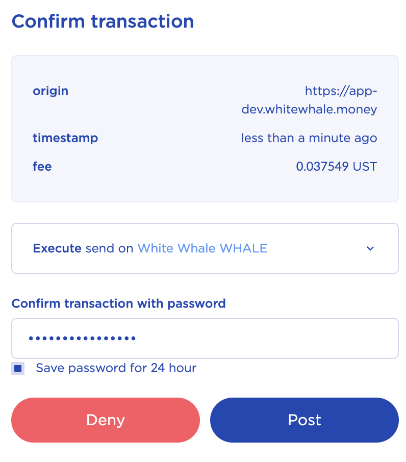

# Governance Staking V1

**WHALE Tokens can be staked at** [**https://app.whitewhale.money/gov**](https://app.whitewhale.money/gov)**.**

The **White Whale Governance Staking V1** is a fork of Anchor Protocol's Governance Staking smart contracts. White Whale periodically distributes WHALE tokens from the none circulating supply to the governance stakers.

The **White Whale Governance Staking V1** auto-compounds the rewards the rewards for the user. 

> Tutorial assumes you have:  
> A Terra Wallet. If not, see the WebApp section.  
> WHALE tokens. If not, see the Swap section. 

### Staking WHALE

**1.** Navigate to the **\[GOVERNANCE\]** page

**2.** Select **\[STAKE\]**

**3.** Input the amount of whale you would like to stake then select **\[Confirm\]** 

**4.** Select **\[POST\]** to confirm transaction in terra station 

**5.** Your WHALE staked will show up here. The rewards will claimed automatically and you will see the number go up over time. 

### Unstaking WHALE

**1.** Navigate to the **\[GOVERNANCE\]** page

**2.** Select **\[UNSTAKE\]**

**3.** Input the amount of whale you would like to unstake and select **\[Confirm\]**

**4.** Select **\[POST\]** to confirm transaction in terra station 

