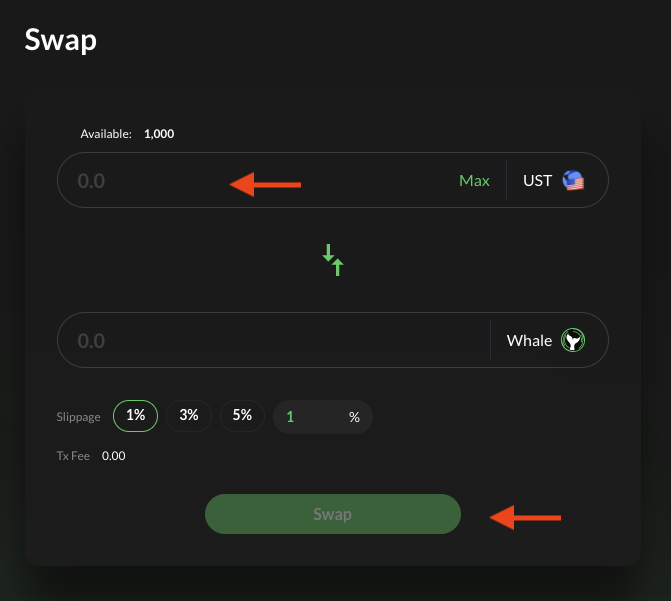
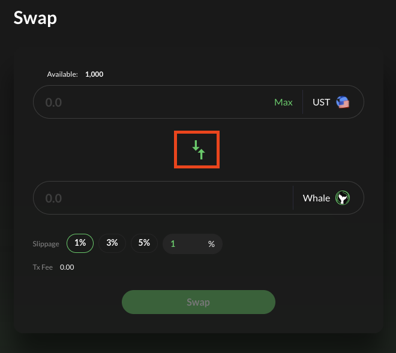

# Swapping

**Whale Tokens can be swapped at** [**https://app.whitewhale.money/swap**](https://app.whitewhale.money/swap)**.**

The **WHALE** tokens can be used for governance staking and voting. See **STAKING** section for details.  

> Tutorial assumes you have:  
> A Terra Wallet. If not, see the WebApp section.

### Swapping UST to WHALE

1. Connect Wallet

2. Navigate to the **\[SWAP\]** page

3. Enter the amount of UST you want to swap to WHALE. Then select **\[SWAP\]**. 

4. Select **\[POST\]** to confirm transaction

5. Your WHALE tokens will show up in your wallet shortly!

### Swapping WHALE to UST

1. Navigate to the **\[SWAP\]** page

2. Switch to swapping WHALE to UST by hitting the arrow icon. 

3. Enter the Amount of WHALE you want to swap to UST then hit Swap. 

4. Select **\[POST\]** to confirm transaction

5. Your UST will show up in your wallet shortly!