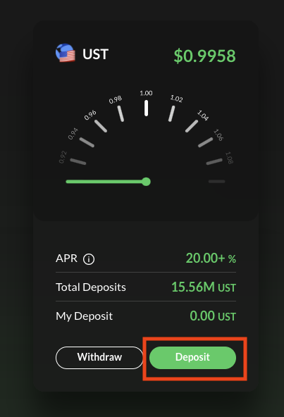
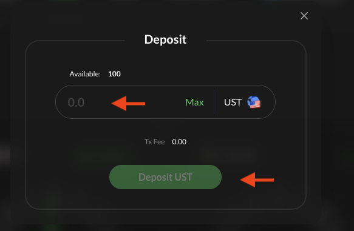
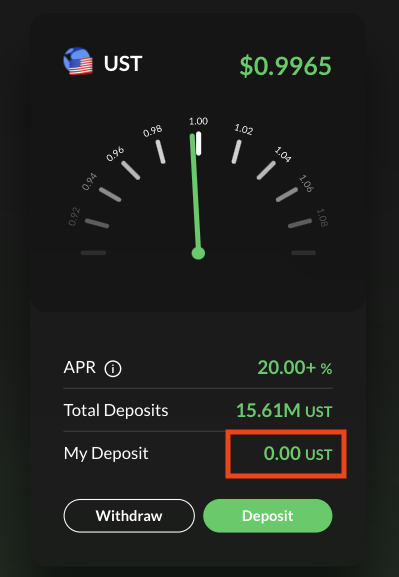
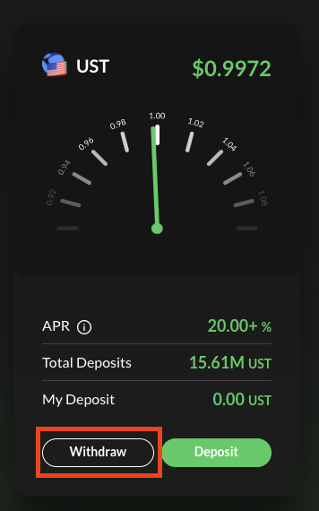
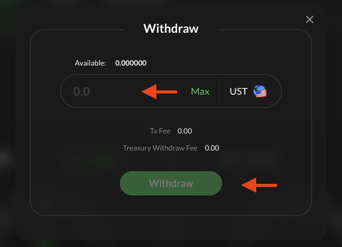

# Vaults

**Tokens can be deposited into Vaults at ** [**https://app.whitewhale.money/gov**](https://app.whitewhale.money/vaults)**.**

> For this tutorial you need a Terra wallet with with UST. 
> a Terra wallet. If not, see the WebApp section.  

### Depositing into Vault

**1.** Navigate to the **\[Vaults\]** page

**2.** Select **\[DEPOSIT\]**

**3.** Input the amount you would like to deposit then select **\[DEPOSIT\]** 

**4.** Select **\[POST\]** to confirm transaction in terra station 

**5.** Your deposit will show up here. The rewards are automatically claimed. 

### Withdrawing from Vault

**1.** Navigate to the **\[Vaults\]** page

**2.** Select **\[Withdraw\]**

**3.** Input the amount of whale you would like to unstake and select **\[Withdraw\]**

**4.** Select **\[POST\]** to confirm transaction in terra station 

